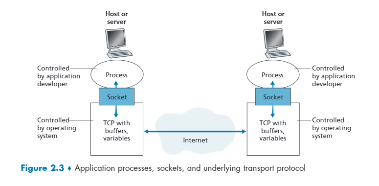
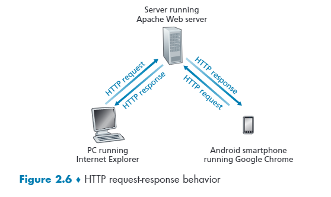
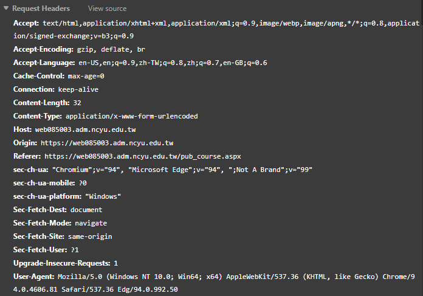

# 第二章 - Application Layer 應用層

## 2.1 網路應用原則

### 2.1.1 網路架構

#### **Client-Server**

Server 通常是隨時啟動的狀態，且有著固定的 IP 位址，大部分都放在 `data center`，用來做較好的資安防護，以及彈性規模的增減。

Client 若要與 server 聯繫，需要知道 server 的位址。Client 在主層架構下通常都是主動的，而 server 是被動的。Client 與 client 的互動不直接聯繫，而是透過 server 當中介。

範例通訊協議: https, ftp

#### **P2P(Peer to peer)**

一個端點叫做一個 peer，每一個端點都可以相互直接溝通，通常會有個 `indexed server` 來儲存現在有哪些 peers。由於 peer 可能是動態 IP，所以如果有 IP 的變動需要告訴 indexed server。

範例: P2P 檔案分享

### 2.1.2 通訊過程(Processes communicating)

#### **Client and server process**

> 在主從架構下，發起初始請求的那一端就是 `Client`，而等待被連線的那一端就是 `Server`。

以網頁(web)來說，瀏覽器用戶對網頁伺服器發起了請求，那麼瀏覽器用戶這邊就被稱為 `Client`，相對的，網頁伺服器那一方就被稱為 `Server`。

而 P2P 架構下，一個 peer 由於可以下載其他 peer 的資料或者上傳資料給其他 peer，所以一個 peer 可以是 `Client` 或 `Server`。

#### **Socket(網路接口)**

> 當一對 Processes 在運作的時候，資料必須經過底層網路的傳送，而這個可以接收資料和送出資料的這個軟體接口(software interface)，被稱之為 `socket`

#### **API (Application programming interface)**

> 一個 API 可以理解為一個窗口或接口，在窗口的外部使用者不需要理解內部的運作模式，只要能夠把資料餵進去，並且得到預期的資料就可以。

在上面這張圖可以看到，`Socket` 的兩端連結著不同的 host，中間可能以複雜且底層的傳輸協定所構成，但是無論如何，送出資料的那方終究可以讓接收那方得到資料，那麼中間這個 `Socket` 就可以當成是個接口，或者說是 `API`。

#### **Addressing process**

當網路在傳遞資料的時候，為了要辨別資料是什麼，通常需要兩種東西: `Host 的位址`、`在接收端的辨別碼`。前者通常就是 `Ip address`，而後者就是使用 `port number`。Port number 的範圍為 2 bytes(0 ~ 65535)

幾個常用的 port 有:
- 80 port (Http協議通道)
- 25 port (Mail協議通道)

### 2.1.3 Transport Services Available to Application

#### **Reliable data transfer**

由於第一章提過資料在傳送的時候可能會丟失封包。然而在某些情況下，例如銀行轉帳、email傳送或者是檔案分享時，這些動作要求絕對的資料正確性。

這時候如果有一個協議他如果能確保傳遞過去的資料是完整正確的，那麼就可以稱他為`Reliable data transfer`。

#### **Throughput 最小傳輸量**

由於一台 host 可能有許多的 processes 在運作，每條 process 的 bandwith 可能都不一樣，bandwith 會隨著時間變動，因此就有傳輸層協議可以限制一筆資料的最小傳輸量。有這種 throughput 限制的應用程式我們會稱其為 `bandwith-sensitive application`。

#### **Timing 延遲**

有時候有些應用程式需要及時的資料，例如遊戲、電話、線上會議或遠端操作等，若延遲太高會有不好的體驗。某些傳輸層的協議就可以確保資料在幾毫秒的時間可以到達，達成低延遲傳輸。

#### **Security 資安**

為了資安的因素，某些傳輸層的協議會將送出的資料加密，並在抵達目的後解密。

### 2.1.4

#### **TCP service**

- connection-oriented (連接導向): 

每當要建立一個 TCP 連線時，lient 和 server會送出三個封包來確保連線，又被稱為`握手協議`，當握手協議完成後，兩端的 socket 就有了 TCP 協議的連線。在連線過後必須要斷開連線。

- Reliable data transfer:

TCP 協議是一個 `Reliable data transfer`，也就是說它可以確保資料的正確性以及傳輸的順序

除此之外 TCP 也有 `Congestion-control`，用來避免高頻寬連線把整個網路癱瘓，或者說是避免一個連線把所有網路的頻寬佔走。

#### **UDP service**

- unreliable transport:

UDP 是一個非常輕量的傳輸協議，他沒有握手協議，並且資料經過 UDP socket 時，沒辦法確保資料傳遞後的正確性以及順序。

#### **Securing TCP**

在上面的敘述中，可以發現 TCP 和 UDP 是沒有加密的，有資安的疑慮，這時候就有了 `Transport layer security (TLS)`。

`TLS TCP` 不只有 TCP 協議原本的東西，他還有加密的過程。`TLS TCP` 有自己的 `TLS TCP socket`，跟原本的 `TCP socket` 差不多，資料在經過 API 時會進行加密，並且抵達目的之後，會再經過一次 API 解密。

### 2.1.5 Application-Layer Protocols

> 一個 application-layer protocol 定義了應用程式的連線、如何在不同的 host 上交流。

`Application-layer protocol` 定義了下列東西: 

- Request messages and response messages
- 不同 messages 的語法型別
- 每個 fields 的資料意義
- 一個用來判定如何送出訊息和對訊息做出反應的規則

## 2.2 The Web and HTTP

### 2.2.1 HTTP 概要

HTTP 全名 Hypertext Transfer Protocol。

常用術語: 
- web page: 由許多 `object` 構造起來的東西。
- object: 就是一個檔案，可以是 html、javascript、css 或 png 檔等...
- base html file: 網頁主體。
- URL: 每個 url 由 hostname(domain) 和 file path 構成。
- web server: 提供網頁伺服器方。

HTTP 的傳輸層協議使用的是 TCP 連線，使用者開啟網頁後會往網頁伺服器傳送取得網頁資料的請求，當網頁伺服器接收到請求時，會送回一個 Response，再根據送回來的檔案在瀏覽器渲染出畫面。

HTTP 是一個 `stateless` 的 protocol，也就是說 HTTP 不會紀錄狀態，平時網頁紀錄狀態的東西是 cookies。

### 2.2.2 Non-persistent and persistent connection

#### **RTT**

`RTT` 是指 client 送出請求到 client 收到 server 回應的時間。

#### **Non-persistent HTTP**

假設我們要取得 Server 端的 10 張圖片，以 Non-persistent http 來說，他會開 11 個 TCP 通道，每個通道負責處理一張圖片，多一條是因為建立 TCP 連線，如此的好處是可以平行處理，整體的時間會比較短。

time = 2RTT + file transmission time

第一個 RTT 是建立 TCP 連線，第二條是往 server 送的 request。 

#### **Persistent HTTP**

以上面取得 10 張圖片的例子，和上面步驟差不多，只是不是同時進行，而是要等待前面的 http 請求處理完後才換下一個。

time = RTT + file transmission time

### 2.2.3 http reqeust format

#### Http request headers

#### Http response header

常見 Status code:
- 200 success
- 400 bad request
- 404 not found
- 500 internal server error
- 505 http version not support

在 Header 中可以看到 `Keep-alive` 標籤，如果是 true 就是 persisten http，false 就是 non-persisten http。

### 2.2.4 Cookies