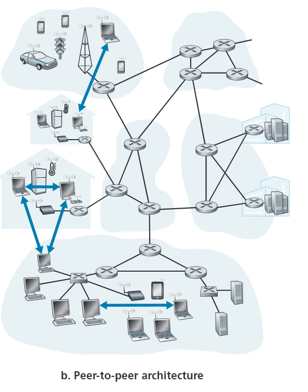
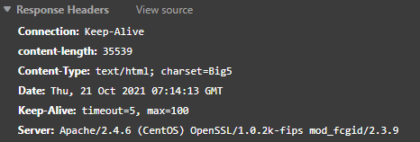
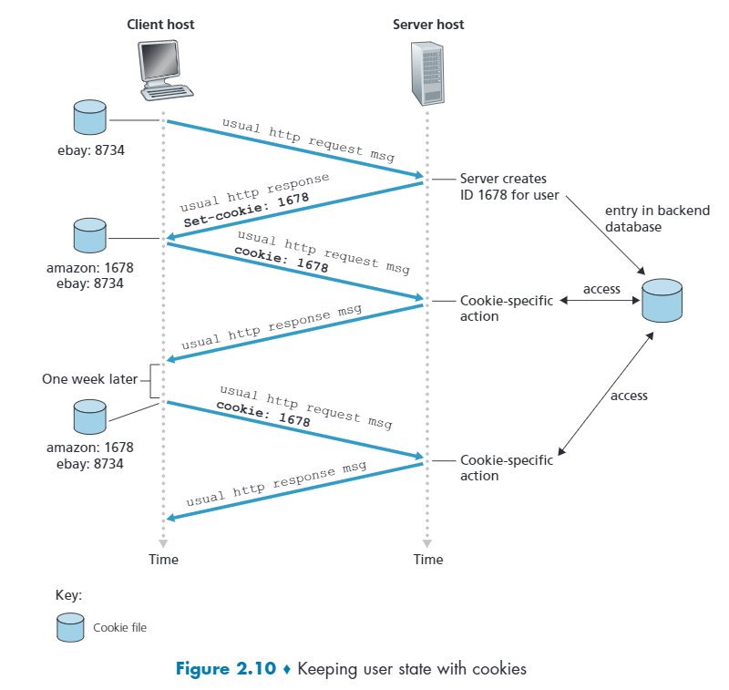
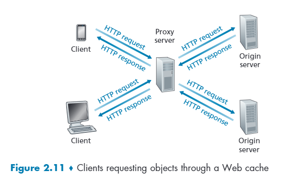

# 第二章 - Application Layer 應用層

## 2.1 網路應用原則

### 2.1.1 網路架構

#### **Client-Server**

Server 通常是隨時啟動的狀態，且有著固定的 IP 位址，大部分都放在 `data center`，用來做較好的資安防護，以及彈性規模的增減。

Client 若要與 server 聯繫，需要知道 server 的位址。Client 在主層架構下通常都是主動的，而 server 是被動的。Client 與 client 的互動不直接聯繫，而是透過 server 當中介。

範例通訊協議: https, ftp

#### **P2P(Peer to peer)**

一個端點叫做一個 peer，每一個端點都可以相互直接溝通，通常會有個 `indexed server` 來儲存現在有哪些 peers。由於 peer 可能是動態 IP，所以如果有 IP 的變動需要告訴 indexed server。

範例: P2P 檔案分享

### 2.1.2 通訊過程(Processes communicating)

#### **Client and server process**

> 在主從架構下，發起初始請求的那一端就是 `Client`，而等待被連線的那一端就是 `Server`。

以網頁(web)來說，瀏覽器用戶對網頁伺服器發起了請求，那麼瀏覽器用戶這邊就被稱為 `Client`，相對的，網頁伺服器那一方就被稱為 `Server`。

而 P2P 架構下，一個 peer 由於可以下載其他 peer 的資料或者上傳資料給其他 peer，所以一個 peer 可以是 `Client` 或 `Server`。

#### **Socket(網路接口)**

> 當一對 Processes 在運作的時候，資料必須經過底層網路的傳送，而這個可以接收資料和送出資料的這個軟體接口(software interface)，被稱之為 `socket`

#### **API (Application programming interface)**

> 一個 API 可以理解為一個窗口或接口，在窗口的外部使用者不需要理解內部的運作模式，只要能夠把資料餵進去，並且得到預期的資料就可以。

在上面這張圖可以看到，`Socket` 的兩端連結著不同的 host，中間可能以複雜且底層的傳輸協定所構成，但是無論如何，送出資料的那方終究可以讓接收那方得到資料，那麼中間這個 `Socket` 就可以當成是個接口，或者說是 `API`。

#### **Addressing process**

當網路在傳遞資料的時候，為了要辨別資料是什麼，通常需要兩種東西: `Host 的位址`、`在接收端的辨別碼`。前者通常就是 `Ip address`，而後者就是使用 `port number`。Port number 的範圍為 2 bytes(0 ~ 65535)

幾個常用的 port 有:
- 80 port (Http 協議通道)
- 25 port (Mail 協議通道)
- 443 port (Https 協議通道)
- 53 port (DNS)

### 2.1.3 Transport Services Available to Application

#### **Reliable data transfer**

由於第一章提過資料在傳送的時候可能會丟失封包。然而在某些情況下，例如銀行轉帳、email傳送或者是檔案分享時，這些動作要求絕對的資料正確性。

這時候如果有一個協議他如果能確保傳遞過去的資料是完整正確的，那麼就可以稱他為`Reliable data transfer`。

#### **Throughput 最小傳輸量**

由於一台 host 可能有許多的 processes 在運作，每條 process 的 bandwidth 可能都不一樣，bandwidth 會隨著時間變動，因此就有傳輸層協議可以限制一筆資料的最小傳輸量。有這種 throughput 限制的應用程式我們會稱其為 `bandwidth-sensitive application`。

#### **Timing 延遲**

有時候有些應用程式需要及時的資料，例如遊戲、電話、線上會議或遠端操作等，若延遲太高會有不好的體驗。某些傳輸層的協議就可以確保資料在幾毫秒的時間可以到達，達成低延遲傳輸。

#### **Security 資安**

為了資安的因素，某些傳輸層的協議會將送出的資料加密，並在抵達目的後解密。

### 2.1.4

#### **TCP service**

- connection-oriented (連接導向): 

每當要建立一個 TCP 連線時，lient 和 server會送出三個封包來確保連線，又被稱為`握手協議`，當握手協議完成後，兩端的 socket 就有了 TCP 協議的連線。在連線過後必須要斷開連線。

- Reliable data transfer:

TCP 協議是一個 `Reliable data transfer`，也就是說它可以確保資料的正確性以及傳輸的順序

除此之外 TCP 也有 `Congestion-control`，用來避免高頻寬連線把整個網路癱瘓，或者說是避免一個連線把所有網路的頻寬佔走。

#### **UDP service**

- unreliable transport:

UDP 是一個非常輕量的傳輸協議，他沒有握手協議，並且資料經過 UDP socket 時，沒辦法確保資料傳遞後的正確性以及順序。

#### **Securing TCP**

在上面的敘述中，可以發現 TCP 和 UDP 是沒有加密的，有資安的疑慮，這時候就有了 `Transport layer security (TLS)`。

`TLS TCP` 不只有 TCP 協議原本的東西，他還有加密的過程。`TLS TCP` 有自己的 `TLS TCP socket`，跟原本的 `TCP socket` 差不多，資料在經過 API 時會進行加密，並且抵達目的之後，會再經過一次 API 解密。

### 2.1.5 Application-Layer Protocols

> 一個 application-layer protocol 定義了應用程式的連線、如何在不同的 host 上交流。

`Application-layer protocol` 定義了下列東西: 

- Request messages and response messages
- 不同 messages 的語法型別
- 每個 fields 的資料意義
- 一個用來判定如何送出訊息和對訊息做出反應的規則

## 2.2 The Web and HTTP

### 2.2.1 HTTP 概要

HTTP 全名 Hypertext Transfer Protocol。

常用術語: 
- web page: 由許多 `object` 構造起來的東西。
- object: 就是一個檔案，可以是 html、javascript、css 或 png 檔等...
- base html file: 網頁主體。
- URL: 每個 url 由 hostname(domain) 和 file path 構成。
- web server: 提供網頁伺服器方。

HTTP 的傳輸層協議使用的是 TCP 連線，使用者開啟網頁後會往網頁伺服器傳送取得網頁資料的請求，當網頁伺服器接收到請求時，會送回一個 Response，再根據送回來的檔案在瀏覽器渲染出畫面。

HTTP 是一個 `stateless` 的 protocol，也就是說 HTTP 不會紀錄狀態，平時網頁紀錄狀態的東西是 cookies。

### 2.2.2 Non-persistent and persistent connection

#### **RTT**

`RTT` 是指 client 送出請求到 client 收到 server 回應的時間。

#### **Non-persistent HTTP**

假設我們要取得 Server 端的 10 張圖片，以 Non-persistent http 來說，他會開 11 個 TCP 通道，每個通道負責處理一張圖片，多一條是因為建立 TCP 連線，如此的好處是可以平行處理，整體的時間會比較短。

time = 2RTT + file transmission time

第一個 RTT 是建立 TCP 連線，第二條是往 server 送的 request。 

#### **Persistent HTTP**

以上面取得 10 張圖片的例子，和上面步驟差不多，只是不是同時進行，而是要等待前面的 http 請求處理完後才換下一個。

time = RTT + file transmission time

### 2.2.3 http reqeust format

#### Http request headers

#### Http response header

常見 Status code:
- `200 success`
- `400 bad request`
- `404 not found`
- `500 internal server error`
- `505 http version not support`

在 Header 中可以看到 `Keep-alive` 標籤，如果是 true 就是 persistent http，false 就是 non-persistent http。

### 2.2.4 Cookies

由於 HTTP 有所謂的 `stateless` 的概念在，前一次的 http request 和下一次的 http request 不能有狀態的關聯，所以要用到類似狀態的功能 `Cookies` 就是相對應的功能。

主要過程大概就是 server 第一次回應給客戶端的時候會給一個獨特的 cookie id，客戶端的瀏覽器會存儲這個 id，同時 server 後端的資料庫也會存儲這個 id，之後只要這個客戶端傳送的資料有 cookie id，那麼 server 就可以針對特定的 user 做相對應的動作，藉以達成 state 的概念。

### 2.2.5 Web caches (Proxy servers)

Proxy server 會存儲一些資料，如果 proxy server 有客戶端需要的東西的話，那麼 proxy server 可以直接提供，否則 proxy server 會往 server 送一個完整的 request 來取得資料。

通常會應用在當區域網的速度遠大於連接外網的速度時，由於連接外網的速度比較慢，這時候如果內網有一個類似暫存的東西在，那麼就可以直接在內網先看有沒有資料是可以直接回傳的，沒有再跟外網的伺服器去要。

目前已很少見，這項技術是用在以前網路速度不夠快的時候，現在網頁的頻寬已經足夠了。

補!!

#### **Conditional GET**

客戶端本身會存有 local cache，並且記錄上次的更新時間，客戶端往 server 送資料時會送一個有 if-modified-since header 的 request，如果 server 修改日期和客戶端 local cache 的一樣的話，那麼 server 就不會送東西回來，而客戶端會直接依據本身的 local cache 來顯示相對應的 object。

### 2.2.6 HTTP/2

> HTTP/2 是為了解決 first come first serve 的 HOL(Head of Line) blocking 問題。

在 HTTP/1 時，為了解決這種 HOL blocking 的問題，通常都是開好幾條的平行 TCP 連線(假設有 n 條)，但是這樣的問題是每一個 TCP 連線頻寬都會被分成`總頻寬/n`的量，且有種作弊的手段是直接開好幾條的 TCP 連線只為了接收一個東西，這樣就可以把很多頻寬給佔走。

HTTP/2 就是為了解決上面的問題，並且將 server 與 client 端的 socket 數量盡可能減少，較容易維護。

#### **HTTP/2 Framing**

HTTP/2 會把 server 的 response 切成很多塊，並且輪流送出。所以如果有一個很大的物件和一些小的物件，這些物件都會被切成許多片段，並且輪流送出，那些小物件就不需要等待一個大物件送出時才被處裡。

#### **Response Message Prioritization and Server Pushing**

HTTP/2 支援可以幫資料附上`Weight(權重)`，權重高的優先被傳送，這樣可以有效提高程式的效率。

另一個 HTTP/2 支援的功能是客戶端可以只送一條 request，而 server 能夠送好幾條 response 給客戶端，如此就不需要等待客戶端一個一個的送 request。

## 2.3 Electronic Mail in the Internet

> Email 的構成主要有三個重要的核心:
> - user agents: 指使用者發送電子郵件的軟體，例如 Microsoft Outlook、Gmail 等
> - mail servers: 可以想像成郵局，內部存放著 `mail  box`、`message queue`
> - SMTP: email 的通訊協議，是應用層的協議，是利用傳輸層的 TCP 搭構起來的。

假如 Alice 要寄信給 Bob，一個訊息送出的過程大致如下:

1. Alice 在自己的 `user agent` 寫好郵件，並傳給自己的 `mail server`，`mail server` 將資料放進 `message queue`。
2. Alice 的 `mail server` 傳送信件給 Bob 的 `mail server`。
3. Bob 的 `mail server` 將他的信件放在他的 `mail box`裡面。
4. Bob 再到自己的 `mail box` 查看郵件。

假如信件沒有成功寄到 Bob 的 mail server，那麼 Alice 的 mail server 會將信件`暫時放在 message queue`，並將再 30 分鐘內再寄一次。倘若過了好幾天都沒成功，那麼 Alice 的 mail server 會告訴 Alice 信件寄送失敗(將失敗通知信放到 Alice 的 mail box )，並且將那封信從 mail queue 移除。

### 2.3.1 SMTP

SMTP 是一個比 HTTP 還要古老的協議，SMTP 限制傳輸的資料必須要是 7-bit ASCII 的編碼，放在當今的角度，已經是十分過時的限制。

在上面的步驟 2~3 中間可以再拆分成幾個細節:
1. Alice 的 mail server 看到 message queue 有信件，會與 Bob 的 mail server 建立 TCP 連線。
2. 經過一些 SMTP 握手程序，Alice 的 SMTP client 會把訊息放進 TCP connection。
3. 最後 Bob 的那一端(SMTP server side)收到信件後再把信放到 Bob 的 mail box 裡面。

最後是 SMTP 傳輸過程的範例

    S:  220 hamburger.edu
    C:  HELO crepes.fr
    S:  250 Hello crepes.fr, pleased to meet you
    C:  MAIL FROM: <alice@crepes.fr>
    S:  250 alice@crepes.fr ... Sender ok
    C:  RCPT TO: <bob@hamburger.edu>
    S:  250 bob@hamburger.edu ... Recipient ok
    C:  DATA
    S:  354 Enter mail, end with ”.” on a line by itself
    C:  Do you like ketchup?
    C:  How about pickles?
    C:  .
    S:  250 Message accepted for delivery
    C:  QUIT
    S:  221 hamburger.edu closing connection

### 2.3.2 Mail Message Formats

header:
- from: 
- to: 
- subject: 

body: 

### 2.3.3 Mail Access Protocols

IMAP(Internt Mail Access Protocol)
#待補

## 2.4 DNS - The internet's Directory Service

在一般世界中，每個人的身分證字號是獨一的，但是我們不會稱呼別人叫做 `Sxxxxxxxxx`，而是會稱呼別人的名字。在網路世界亦同，IP 位址就是身分證字號，而那個 IP 位址代表的名字我們會給他一個 hostname，例如 `www.google.com`、`www.facebook.com`。

DNS(Domain Name System) 就是負責處理這個問題的。

### 2.4.1 Services Provided by DNS

DNS 的傳輸層協議是使用 UDP，並且使用 port 53。

一般來說，當我們要拜訪一個網頁時，，那麼瀏覽器會將 URL 中的 hostname 傳送給 DNS server，DNS server 找到相對應的 Ip address 後回傳，瀏覽器再根據回傳的 Ip address 建立 TCP 連線。通常這些查表的結果會 cached 在附近的 DNS server，降低 delay。

#### **Host aliasing**

一個主機可能會有一個複雜的 hostname，這個複雜的 hostname 我們叫他 `canonical hostname(典範 hostname)`，可以理解為較正式的名稱。然而有時候他可能有其他的別名相對好記，DNS server 可以利用別名查詢找到相對應的`典範 hostname` 或是 ip address。
13 台 root DNS

#### **Mail server aliasing**

大致上和 host aliasing 差不多，只是換成 email 的版本。

#### **Load distribution(負載平衡)**

DNS 還可以幫 hostname 設定多個 ip，自動分散網路流量，這樣對於一些較繁忙的網站可以分擔負荷。

### 2.4.2 Overview of how DNS Works

如果世界上只有一個 DNS server，那麼他每天將要負荷數以億計的網路流量，並且要記錄上百千萬個 hostname。除此之外，如果這個 DNS server 因為某些原因崩潰了，那就代表全世界的網路都崩潰了。

#### **A Distributed, Hierarchical Database**

為了避免上述問題，DNS 的 `root server` 在全世界有 13 台，並且整個 DNS 架構是採用`樹狀`的架構來管理分工。在 root server 下方還有分成管理 `.org`、`.net`、`.edu`、`.tw`、`.us`等..，這些較高層級的 DNS server 叫做 `TLD(Top-level domain servers)`。

#### **Authoritative DNS servers**

Authoritative DNS servers 是指提供查詢 hostname 對應到 ip address 的主機。通常每個大企業都至少會有一個，可能是花錢買或自己實作管理。

#### **Local DNS server**

Local DNS server 不隸屬於整個 DNS 的等級層級。如果是使用 ISP 業者提供的網路服務，那麼 local DNS server 會是由 ISP 提供。

在 windows 系統的小黑窗打上 `ipconfig` 可以查詢自己的 dns server。

#### **iterated query / recursive query**

在上面這張圖中，從 requesting host 到 local DNS server 是遞迴式的(recursive)，而local DNS server 與其他三台 DNS 的互動是迭代式(iterated)的。

#### **DNS caching**

當一台 DNS server 接收到另一台 DNS server 的答覆時，接收到的這台會先將這對 map 先存放到 local memory，這樣下次只要有同樣的 query 就可以直接回覆，而不需要再經過一次 iterated/recursive query。

cache 的儲存時間差不多是 2 天。

### 2.4.3 DNS Records and Messages

DNS 存儲的資料為 RRs(resource records)，RRs 內包含了 hostname 到 Ip address 的 mapping。

RRs 的儲存格式為 4-tuple 的資料 `(Name, Value, Type, TTL)`。

- Type: 根據類別的不同 Name 和 Value 也有不同的意義
  - `A`:
    - Name: hostname
    - Value: Ip address
  - `NS`:
    - Name: domain
    - Value: 這個 domain 所對應到的 authoritative DNS server
  - `CNAME`:
    - Name: alias hostname
    - Value: canonical hostname(典範 hostname)
  - `MX`:
    - Name: 針對 mail server 的 alias hostname
    - Value: 針對 mail server 的 canonical hostname(典範 hostname)
- TTL: 紀錄了 RRs 的儲存時間，時間一到就會被記憶體釋放。

#### **DNS Messages**

上圖中 12 bytes 的區域為 `header section`通常 1 bit 的區域都是代表一種 flag，表示 true or false，例如 `query/response flag`、`recursive flag`...等。

Question 的部分是 query 的詳細資料，例如 query 的 name 以及 type。

Answer 的部分為 DNS server 回傳的 RRs。

其他部分待補。

一個 DNS query 可以傳回多筆 DNS messages。

## 2.5 Peer-to-Peer File Distrubution

P2P 是一個 `not always-on server` 的型式，peer 的 Ip 可以變動，相對的由於 Ip 會隨著時間不同，整體節點的管理會很複雜。主要應用有檔案分享 (BitTorrent) 以及通話連線 (Skype) 或串流 (KanKan)。

### Scalability of P2P Architechures

比較 P2P 和 client server 連線方式在用戶數量上升的對比:

先假設`檔案大小為 F`、`伺服器上傳速率為 u`、`有 N 位用戶`、`第 i 位用戶的下載速率為 di`、`第 i 位用戶的上傳速度為 ui`。

> #### client-server 主從架構

伺服器上傳給一個用戶的時間即為

，上傳給 `N` 位使用者的時間則為
。

已知第 `i` 位客戶的下載時間為 

，那麼 `N` 位使用者中，下載時間最長(下載速度最低的)用戶則為 

，暫且稱他為 
。

這邊有個重點，**「伺服器上傳時，客戶也在下載」**，這樣可以得知客戶下載速度不是跟 server 上傳速度快，不然就是比 server 上傳慢(因為瓶頸在 server)。下面是示意圖，紫色就是下載速度比 server 上傳慢。

這樣可以得知 

)，注意是大於等於，右邊是最理想情況。只要沒有客戶端的網速是極度龜速，通常瓶頸都是出現在 server 端。

> #### P2P 點對點連線

和 `client-server` 差不多，但是 server 只需上傳一次，且多了其他的 peer，所以總體的時間會變成 

可得

)

所以如果使用者人數 N 上升，那麼檔案分享時間的成長幅度會比 client-server 的方式叫平緩。

[CS_vs_P2P 練習](https://gaia.cs.umass.edu/kurose_ross/interactive/CS_vs_P2P_download.php)

### **BitTorrent**
名詞解釋
- tracker: 可以當成 indexed server
- torrent: 一個網路拓樸

#### 原理

把檔案切成許多的 chunk，使用者下載時根據哪個 peer 有需要的 chunk 就可以直接要資料了。取得資料後也能成為一個 peer，提供資料給其他人。當取得所有資料後可以選擇直接離開，或是直接留在 torrent。

BitTorrent 有使用到一種 tit-for-tat 的 trading algorithm，只要不分享給別人，自己的下載速度也會跟著下降。

## 2.6 Video Streaming and Content Distribution Networks

### 2.6.1 Internet Video

影片是由許多幀的圖片所構成，一個圖片又是以許多的 pixel 所構成，如此一來如果沒有作特殊處理檔案會十分巨大，編碼 (coding) 就是在做這件事情。

- CBR(constant bit rate): video encoding rate fixed
- VBR(variable bit rate): video encoding rate changes as amount of spatial, temporal coding changes (居多)

#### 播放預錄影片

一邊傳送影片，客戶端一邊播放。

#### 播放暫存 (buffer)

收到一定資料量再播放。

### 2.6.2 HTTP Streaming and DASH

DASH(Dynamic Adaptive Streaming over HTTP) 在 http 的基礎上新增功能，server 端的影片用多種的 bit rate 來編碼，這樣就有不同的畫面品質(版本)。使用者每隔一段時間請求一個片段，接著再依據使用者的可以接受的頻寬來選擇想要的編碼品質。

在 server 那一邊有 `manifest file` 提供不同版本的影片的 URL，客戶端發起請求後根據 manifest file 下載影片片段，同時也量測網路頻寬，如果現在 buffer 夠多那就選擇高畫質，反之亦然。

### 2.6.3 Content Distribution Networks(CDN)

CDN 的運作思想就是把資料放在離使用者較近的地方，以達成分散的方式，具體作法就是跟各地網路業者租借伺服器來擺放資料。

- Enter Deep: 跟 ISP 業者買伺服器架設在他們的伺服器。
- Bring Home: 把資料放在 IXPs(Internet exchange points)。

CDN 傳遞示意圖

#### 選擇 CDN 伺服器

- geographically closest: 選擇地理上最近的，優點是大部分速度都滿快的，缺點是少數用戶地理上最近可能不是最佳解
- real-time measurements: CDN 定時 ping 用戶，實際量測時間選擇最佳解，缺點是大部分 local DNS 沒有設定應對這樣的 response。

## 2.7 Socket Programming: Creating Network Applications

略

