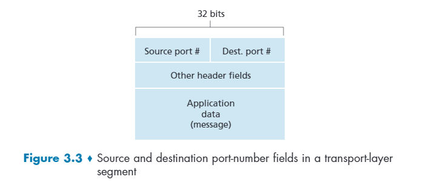

# Transport Layer(傳輸層服務)

## 3.1 Introduction and Transport-Layer Services

傳輸層協議在不同 host 的應用程式提供 `logical communication`，除此之外，傳輸層不在 router 中被實作，而是在 host 端點被實作，router 只有負責到網路層而已。

傳輸層協議將應用層的訊息切割成不同 packet，在傳輸層又被稱為 `segment(線段)`，並附上傳輸層的 `header`，再往下傳給網路層來處理，最後將資料送到對方後再一層一層往上包裝。

### 3.1.1 Relationship Between Transport and Network Layers

#課本在這邊用舉例方式說明，這邊就不贅述。

### 3.1.2 Overview of the Transport Layer in the Internet

> 由於網路層 (IP 那一層)只有做到 `best-effort delivery service`，但它不保證資料正確性、順序性，所以網路層是 `unreliable service`。傳輸層就是以網路層的基礎下做延伸的。

#### 主要兩大協議: TCP, UDP[兩個介紹可以到第二章](../chapter-2/Application%20Layer.md)

- UDP: 提供`資料正確性檢查(data integrity)`及`錯誤偵測(error detection)`，但不保證資料能夠送到。
- TCP: 是 reliable data transfer，並且提供`壅塞控制(congestion control)`。

這兩個協議不提供:
- delay guarantees
- bandwith guarantees

## 3.2 Multiplexing and Demultiplexing

一個 `Process` 可以有多個 sockets，已經知道應用層的訊息傳到傳輸層會附加上 `header`，這個 header 就是用來給傳輸層判斷要把哪個資料傳到哪個 socket。

header 內部的資料有`傳輸層協議的 identifier`、`來源 port`、`目的地 port`...等。

在傳送端，傳輸層將上層的資料切成 segment 並且加上 header 接著送往網路層，這個動作被稱為 `multiplexing(多工)`；在接收端，傳輸層依據 header 的內容將資料送到正確的 port，這個動作被稱為 `demultiplexing(解多工)`。

在[上個章節](../chapter-2/Application%20Layer.md)有提到 port number 的範圍是 0~65535。port 0~1023 都是 `well-known port numbers`，並且通常不讓 client 來使用(restricted)。

#### Connectionless Multiplexing and Demultiplexing(UDP)

UDP socket 只需要一個 `2-tuple` 來辨識就可以: `(目的地 ip, 目的地 port)`，來源端 IP 和 port 可能會不同，但是最後一定會送到相同的 socket，只要 2-tuple 相同就好。

#### Connection-Oriented Multiplexing and Demultiplexing(TCP)

TCP socket 需要 `4-tuple` 來辨識: `(來源 ip, 來源 port, 目的地 ip, 目的地 port)`。一個 server 會 handle 許多不同的 TCP connection，這時候就會用到 4-tuple 來區別不同的資料要送哪些 port。

## 3.3 Connectionless Transport: UDP

UDP(User Datagram Protocol) 沒有握手程序，每個封包都是獨立的，不保證資料正確性以及順序性，也沒有 congestion control，沒有 RTT。

UDP有以下特點
- **Finer application-level control over what data is sent, and when**: 相比 TCP 來說，它可以更快的送出資料，並且在壅塞時仍然可以運作，而不像 TCP 需要一直重傳，對於需要低延遲且資料正確性為其次的應用程式來說是更好的選擇，例如串流。
- **No connection establishment(不需要連線建立)**
- **No connection state(無連線狀態)**: 管理成本低，相比 TCP 來說更有可能同時管理更多活躍用戶。
- **Small packet header overhead(header 小)**: TCP header 要 20 bytes，UDP 只要 8 bytes

使用UDP的例子: DNS, SNMP, HTTP/3。

### 3.3.1 UDP Segment Structure

UDP segment 的資料架構如下圖

- source port: 來源 port
- Dest. port: 目的地 port
- Length: 資料長度，單位是 bytes
- checksum: 用來做初步的錯誤檢測用的
- Application data: 主要訊息

### 3.3.2 UDP Checksum

checksum: 判斷傳出去的資料有沒有發生錯誤，利用 1 補數來加法，未必能夠完全判斷資料是正確的(可能跳位跳太多，導致算出來的結果仍然是正確的)，若要做更多的檢查要在應用層做(HTTP/3)。

[**checks sum 練習題**](https://gaia.cs.umass.edu/kurose_ross/interactive/internet_checksum.php)

## 3.4 Principles of Reliable Data Transfer

應用層之間底層的傳輸如果可以確保資料的正確性以及順序性，那就稱為 reliable data transfer(rdt)。由於網路層是不可靠的，所以要實作必須在傳輸層。

### 3.4.1 Build a Reliable Data Transfer Protocol

#### Reliable Data Transfer over a Perfectly Reliable Channel: rdt1.0

資料流向只考慮單向，那 perfectly reliable channel 的 FSM(finite state machine)是非常簡單的，如下圖。

封包不會遺失，沒有bit error。

#### Reliable Data Transfer over a Channel with Bit Errors: rdt2.0

實際上的應用不會像前面的 rdt1.0 那麼美好，在傳遞的過程中可能會有資料遺失，這時就要用到 error check 的功能了，這邊稱 rdt2.0。

在 rdt 協議中，接收者如果每次收到訊息都會回應一個 "OK"(positive acknowledgments)，如果接收到亂碼，則要求傳送端再次傳送(negative  acknowledgments)。有這種功能的協議被稱為 `ARQ(Automatic Repeat reQuest) protocols`。

ARQ 的三個基本需求
- **Error detection**: 一種用來檢查錯誤的機制，例如 UDP 的 checksum。
- **Reveiver feedback**: 能夠告訴 sender 的回應，有分為 ACK(postive) 和 NAK(negative)。
- **retransmisstion**: 資料的重新傳送。

下圖為 rdt2.0 的 FSM

**註: Λ 代表 empty action**

由上面狀態圖可以發現，只要接收端還沒收到正確的資料，那狀態就會一直再重傳，無法傳下一個packet，因此 rdt2.0 是一個 `stop and wait protocol`。

rdt2.0 聽上去很不錯，但是有致命的問題是，**如果 ACK 或 NAK 發生錯誤了，那麼這個 FSM 會無法辨識接下來要怎麼走**。

#### rdt2.1

下圖為 rdt2.1 的 fsm

